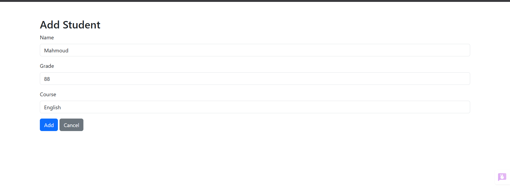
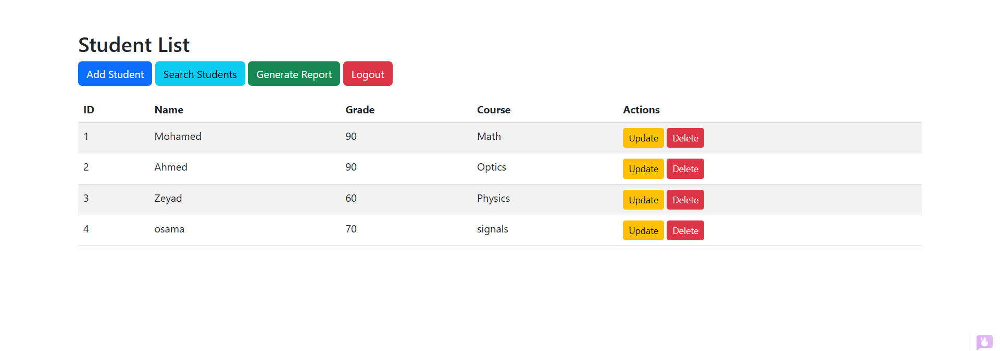
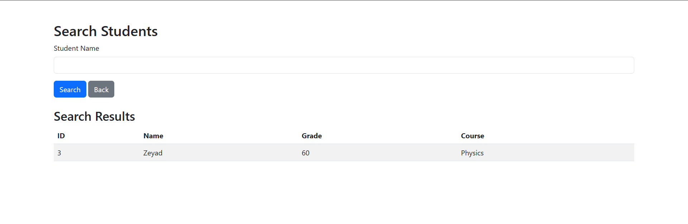

# Student Database Management System

A simple **web-based Student Database Management System** built with **Flask (Python)** and integrated with **C++** for high-performance searching.  
It supports adding, viewing, updating, deleting, and searching student records stored in an **SQLite** database.  
The highlight of this project is its search functionality, implemented in **C++** and compiled into a shared library for optimal speed.

---

## Features

- **User Authentication** – Admin login system.
- **Student Management** – Add, update, and delete records (admin only).
- **View Records** – Display all students in a table.
- **Advanced Search** – Case-insensitive, partial-name matching using a C++ shared library.
- **CSV Export** – Generate a CSV report of all students.

---

## Prerequisites

Make sure the following are installed:

- **Python 3.x** with Flask and Werkzeug  
  ```bash
  pip install flask
  ```
- **SQLite** (bundled with Python).
- **g++ compiler** for C++  
  ```bash
  sudo apt install g++
  ```
- **SQLite development headers** for C++  
  ```bash
  sudo apt install libsqlite3-dev
  ```

---

## Installation & Setup

1. **Clone the repository**
   ```bash
   git clone <repo-url>
   cd <repo-dir>
   ```

2. **Compile the C++ shared library (search module)**  
   Make the compile script executable and run it:
   ```bash
   chmod +x compile.sh
   ./compile.sh
   ```

   **compile.sh** contains:
   ```bash
   g++ -shared -fPIC -o studentlib.so studentlib.cpp -lsqlite3 -O3
   ```
   This generates `studentlib.so`, which Python uses for searching.

3. **Run the Flask application**
   ```bash
   python app.py
   ```
   - Initializes the database `students.db`.
   - Starts the server at **http://localhost:5000**.

4. **Login credentials** (default):
   ```
   Username: admin
   Password: admin123
   ```

---

## Usage

### Add Student
Admin can create new student records.


---

### View Students
See all records in a table.



---

### Search Student
Search by name (case-insensitive, partial match).



---

### Export CSV
Download a CSV file of all students.

---

## Search Feature & C++ Integration

The search functionality showcases **hybrid programming** by combining Python's ease of development with C++'s speed.

### How It Works
1. **User Input** – Name is entered in the search form (`search.html`) and submitted.
2. **Flask Handling** – `/search` route in `app.py` receives the input and calls:
   ```python
   search_students('students.db', name)
   ```
3. **C++ Execution** –  
   - Python uses `ctypes` to load `studentlib.so`.
   - Calls the `search_students` function in C++.
   - Executes SQL:
     ```sql
     SELECT id, name, grade, course 
     FROM students 
     WHERE LOWER(name) LIKE LOWER('%<search-term>%');
     ```
   - Formats results into a buffer.
4. **Python Parsing** – `parse_search_results()` converts the raw output into a list of dictionaries.
5. **Display** – Results are rendered in `search.html`. If none are found, a "No results found" message appears.

---

## Key Files

- **`app.py`** – Flask routes, Python–C++ integration, result parsing.
- **`studentlib.cpp`** – C++ code for database querying and result formatting.
- **`compile.sh`** – Shell script to compile `studentlib.cpp` into `studentlib.so`.
- **`studentlib.so`** – Compiled C++ shared library used by Python.
- **`students.db`** – SQLite database (auto-generated).
- **`templates/`** – HTML templates for UI (`search.html`, `students.html`, etc.).

---

## Why Use C++ for Search?

- Significantly faster than pure Python for large datasets.
- Allows performance-critical logic to run in native code.
- Keeps main application logic in Python for flexibility.

---

## Troubleshooting Search

- Ensure `studentlib.so` is in the same directory as `app.py`.
- Check `app.log` for debug messages.
- If no results appear, verify database contents:
  ```bash
  sqlite3 students.db "SELECT * FROM students;"
  ```

---

## Directory Structure

```
.
├── app.py                 # Main Flask application
├── compile.sh             # Script to compile C++ code
├── studentlib.cpp         # C++ search implementation
├── studentlib.so          # Compiled shared library
├── students.db            # SQLite database (generated)
├── templates/             # HTML templates
└── app.log                # Log file (generated)
```